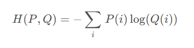
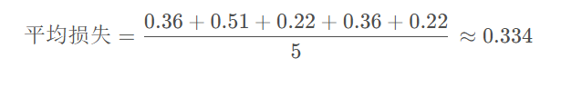
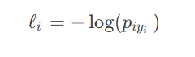
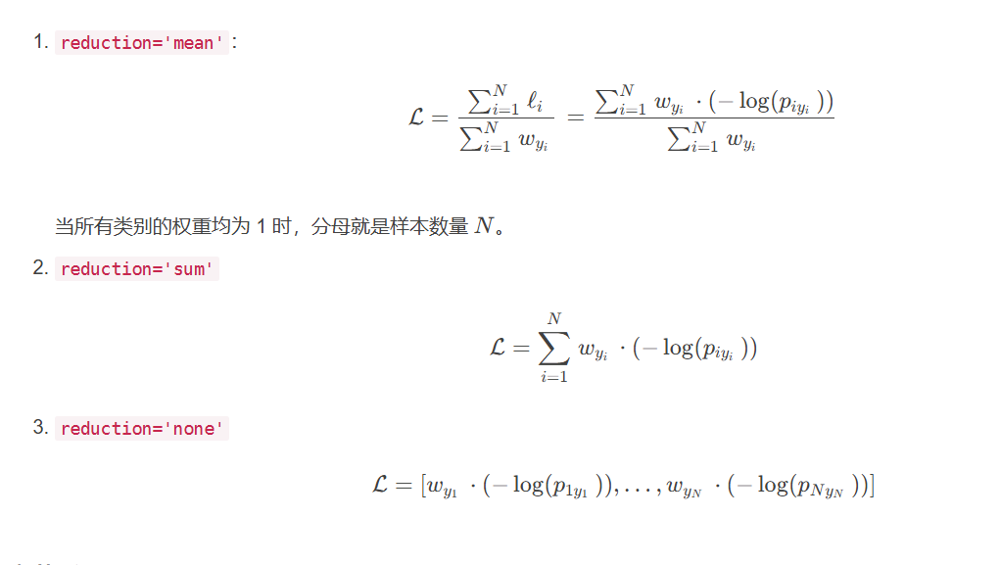

# CrossEntropyLoss()损失函数

nn.CrossEntropyLoss()是用于计算**交叉熵**损失（Cross-Entropy Loss）的损失函数，用于**分类模型**

‍

### 什么是交叉熵？

假设有两个概率分布 P 和 Q，其中 P 表示真实分布，Q 表示模型的预测分布。这两个分布都是离散的，通常用于表示类别的概率分布。交叉熵的计算方式如下：

0到1 的对数值为负数，所以公式前要加一个负数

#### 举例计算交叉熵

假设我们有一个分类任务，共有 3 个类别，并且模型的预测结果和真实标签如下：

* 5个样本所属的真实标签（Ground Truth）：[1, 0, 2, 1, 2]
* 模型的预测概率分布：

  * 类别 0 的预测概率分布：[0.2, 0.6, 0.2]
  * 类别 1 的预测概率分布：[0.7, 0.2, 0.1]
  * 类别 2 的预测概率分布：[0.1, 0.1, 0.8]

* （1）对于第一个样本（真实标签为 1）：

  * 真实标签概率分布：[0, 1, 0]
  * 模型预测概率分布：[0.7, 0.2, 0.1]
  * 交叉熵损失：-1 \* (1 \* log(0.7) + 0 \* log(0.2) + 0 \* log(0.1)) ≈ 0.36

  （2）对于第二个样本（真实标签为 0）：

  * 真实标签概率分布：[1, 0, 0]
  * 模型预测概率分布：[0.2, 0.6, 0.2]
  * 交叉熵损失：-1 \* (0 \* log(0.2) + 1 \* log(0.6) + 0 \* log(0.2)) ≈ 0.51

  （3）对于第三个样本（真实标签为 2）：

  * 真实标签概率分布：[0, 0, 1]
  * 模型预测概率分布：[0.1, 0.1, 0.8]
  * 交叉熵损失：-1 \* (0 \* log(0.1) + 0 \* log(0.1) + 1 \* log(0.8)) ≈ 0.22

  （4）对于第四个样本（真实标签为 1）：

  * 真实标签概率分布：[0, 1, 0]
  * 模型预测概率分布：[0.7, 0.2, 0.1]
  * 交叉熵损失：-1 \* (1 \* log(0.7) + 0 \* log(0.2) + 0 \* log(0.1)) ≈ 0.36

  （5）对于第五个样本（真实标签为 2）：

  * 真实标签概率分布：[0, 0, 1]
  * 模型预测概率分布：[0.1, 0.1, 0.8]
  * 交叉熵损失：-1 \* (0 \* log(0.1) + 0 \* log(0.1) + 1 \* log(0.8)) ≈ 0.22

  真实标签概率分布：[0, 1, 0]
* 模型预测概率分布：[0.7, 0.2, 0.1]
* 交叉熵损失：-1 \* (1 \* log(0.7) + 0 \* log(0.2) + 0 \* log(0.1)) ≈ 0.36

‍

### CrossEntropyLoss函数参数：

torch.nn.CrossEntropyLoss(weight=None, ignore_index=-100, reduction='mean', label_smoothing=0.0)

* **weight** (Tensor, 可选): 一个形状为 ( C ) (C)(C) 的张量，表示每个类别的权重。如果提供了这个参数，损失函数会根据类别的权重来调整各类别的损失，适用于类别不平衡的问题。默认值是 `None`​。

* **ignore_index** (int, 可选): 如果指定了这个参数，则该类别的索引会被忽略，不会对损失和梯度产生影响。默认值是 `-100`​。

* **reduction** (str, 可选): 指定应用于输出的归约方式。可选值为 `'none'`​、`'mean'`​、`'sum'`​。`'none'`​ 表示不进行归约，`'mean'`​ 表示对所有样本的损失求平均，`'sum'`​ 表示对所有样本的损失求和。默认值是 `'mean'`​。
* **label_smoothing** (float, 可选): 标签平滑值，范围在 [0.0, 1.0] 之间。默认值是 `0.0`​。标签平滑是一种正则化技术，通过在真实标签上添加一定程度的平滑来避免过拟合。

‍

### Pytorch 中 CrossEntropyLoss() 函数包含以下步骤：

‍

#### softmax

将其转化为0-1的概率分布

‍

#### **负对数似然**log

‍

#### NLLLoss （用于计算负对数似然损失（Negative Log Likelihood Loss））

‍
